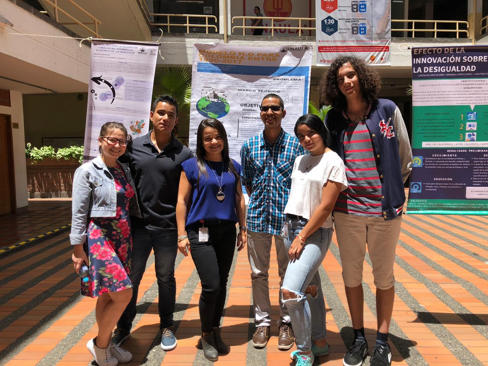

---
---
<link rel="stylesheet" href="styles.css" type="text/css">

Bienvenidxs al Semillero GrEEA! Grupo de estudio en Economía Aplicada.

 
Este es un Semillero de Investigación que tiene como propósito familiarizar a los estudiantes con la investigación aplicada en Economía, mediante el uso de herramientas básicas para analizar problemas económicos y sociales: formulación y desarrollo de proyectos de investigación, manejo y análisis de bases de datos, manejo de sofwares, modelos econométricos, elaboración de artículos académicos.

 
 
 
GrEEA hace parte del grupo [Ginveco](https://www.unaula.edu.co/economia/investigacion/grupo) de la [Universidad Autónoma Latinoamericana](https://www.unaula.edu.co) (Medellín-Colombia) y pueden participar todos lxs estudiantes que tengan interés en ampliar y complentar su formación académica en Economía.
 
 
 
 
***Datos de contacto***
 
 
Email: semillerogreea@gmail.com
 
 
 
***Coordinadora***
 
 
Erika R. Badillo, PhD en Economía 
Email: erika.badilloen@unaula.edu.co 
Website: [ebadilloe.github.io](https://ebadilloe.github.io)

